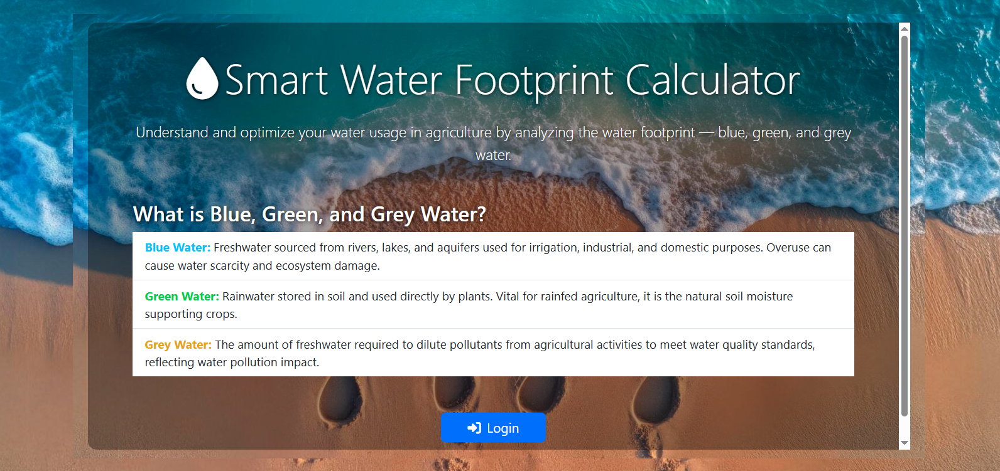

# 💧 Smart Water Footprint Calculator

This is a simple and responsive web application that helps analyze and understand the **Water Footprint** in agriculture — including **Blue**, **Green**, and **Grey water** components.

Developed as part of an academic mini project, the tool calculates water usage based on CSV data and provides a visual, interactive interface for students, farmers, and researchers.

---

## 🌟 Features

- 📘 Explanation of Blue, Green, and Grey water with visuals
- 📊 Water footprint calculator using real data from `water_footprint.csv`
- 🔐 Login page interface (for future integration)
- 🌐 Responsive design with Bootstrap and Font Awesome
- 📁 Clean file organization and modular JavaScript

---

## 📸 Screenshot

---

## 📊 Technologies Used

- HTML5, CSS3, JavaScript  
- Bootstrap 5  
- Font Awesome  
- CSV-based data processing  

---

## 👩‍💻 Developer

**Manasa B M**  
Computer Science Engineering  
REVA University  
📍 Bangalore, India  
📧 bmm065839@gmail.com  
📞 +91 77952 77441  
🔗 [LinkedIn](https://www.linkedin.com/in/manasa-bm-a09524300)

---
